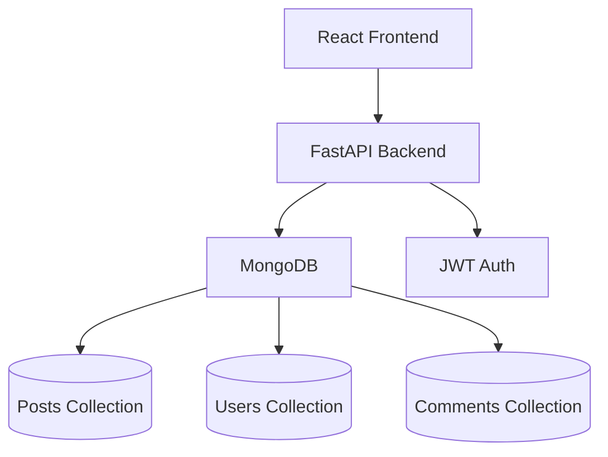
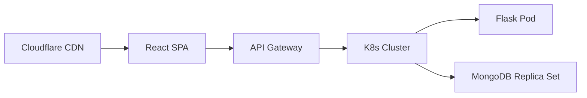

# Blog Application Architecture Documentation
TODO: Where was this generated?

## 1. System Context Diagram


## 2. Core Architecture Decisions
```markdown
### ADR-001: MongoDB vs SQL
- **Decision**: Use MongoDB for flexible schema and document storage
- **Rationale**: Better suited for blog content with varying post formats
- **Consequences**: Requires denormalization for relationships

### ADR-002: JWT Authentication with python-jose
- **Decision**: JSON Web Tokens for stateless auth implemented with python-jose
- **Rationale**: Scalability and decoupled services with secure token management

### ADR-003: FastAPI Framework
- **Decision**: Use FastAPI instead of Flask or Django
- **Rationale**: Modern Python framework with built-in OpenAPI documentation, async support, and type checking
- **Consequences**: Better performance and developer experience
```

## 3. API Specifications (OpenAPI 3.0)
```yaml
openapi: 3.0.0
info:
  title: Blog API
  version: 1.0.0
paths:
  /api/posts:
    get:
      summary: List all posts
      responses:
        '200':
          description: List of blog posts
    post:
      summary: Create new post
      requestBody:
        required: true
        content:
          application/json:
            schema:
              $ref: '#/components/schemas/Post'
```

## 4. Data Model Documentation
**Posts Collection**
```javascript
{
  "_id": ObjectId,
  "title": String,
  "content": String,
  "author": ObjectId,
  "tags": [String],
  "created_at": ISODate,
  "comments": [{
    "user": ObjectId,
    "text": String,
    "created_at": ISODate
  }]
}
```

## 5. Deployment Topology


## 6. Quality Attributes
- **Scalability**: Horizontal pod autoscaling for API
- **Performance**: 200ms max API response time
- **Availability**: 99.95% uptime SLA