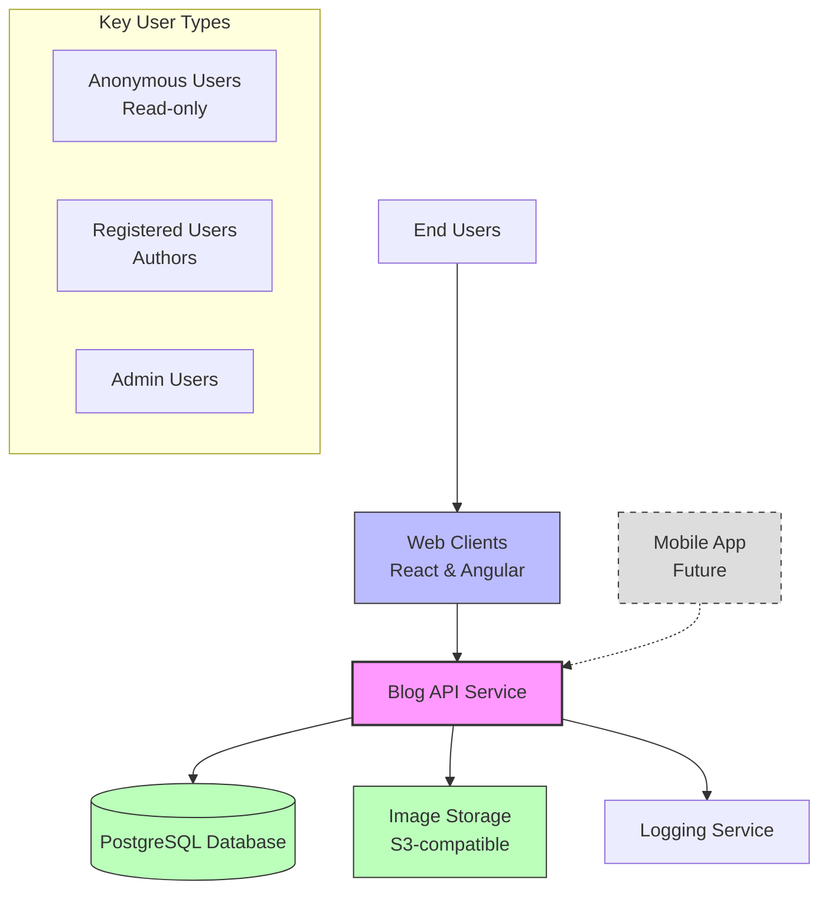
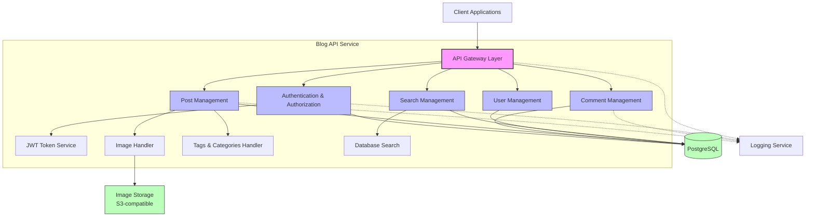
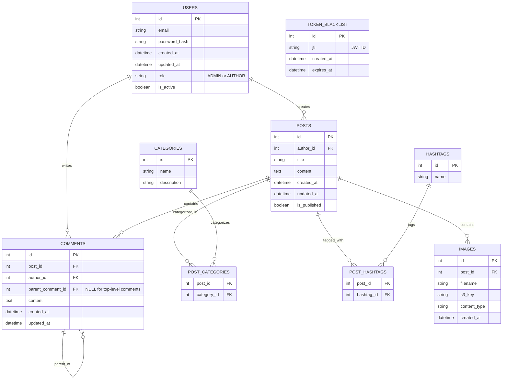

**Produced by Claude 3.7 Sonnet**

Thank you for providing these additional details. Now I have enough information to create comprehensive architecture documents for your blog API project. Let me prepare these key architectural artifacts for you.

# Technology Stack & Architecture Decisions

## Overview
This document outlines the key technology decisions and overall architecture for the Blog API project.

## Core Technology Stack

### Backend
- **Language/Framework**: Python with FastAPI
  - *Rationale*: FastAPI provides modern async capabilities, excellent performance, automatic OpenAPI documentation, and type validation with minimal boilerplate code.
- **Database**: PostgreSQL
  - *Rationale*: Reliable relational database with excellent support for JSON, full-text search capabilities, and strong data integrity features.
- **Authentication**: JWT-based authentication
  - *Rationale*: Stateless authentication that works well with REST APIs and facilitates future mobile integration.
- **Image Storage**: S3-compatible storage
  - *Rationale*: Separates image storage from application code, provides scalability, and easy migration path to AWS S3 in the future.

### Infrastructure
- **Deployment**: Docker containers
  - *Rationale*: Provides consistency between development and production environments, simplifies dependency management.
- **Hosting**: Self-hosted initially
  - *Rationale*: Meets current requirements while keeping costs controlled for a portfolio project.

## Key Architecture Decisions

### 1. Monolithic API Structure
**Decision**: Implement as a single, modular API service rather than microservices.

**Rationale**:
- Simplifies development and deployment for a portfolio project
- Appropriate for the expected low traffic volume
- Easier to reason about and demonstrate as a portfolio piece
- Can be refactored into microservices later if needed

### 2. Database-Native Full-Text Search
**Decision**: Utilize PostgreSQL's built-in full-text search capabilities.

**Rationale**:
- Avoids introducing additional infrastructure components
- PostgreSQL's full-text search is sufficient for the expected data volume and query complexity
- Simplifies the architecture
- Provides a clear migration path to Elasticsearch if needed in the future

### 3. Role-Based Access Control
**Decision**: Implement RBAC with two primary roles (ADMIN, AUTHOR) plus anonymous access.

**Rationale**:
- Provides clear permission boundaries
- Simplifies authorization logic
- Matches the application's user interaction model
- Extensible for future role additions

### 4. Standard REST API Design
**Decision**: Follow REST principles with JSON payloads.

**Rationale**:
- Well-understood by frontend developers
- Compatible with chosen technology stack
- Suitable for both web and future mobile clients
- Facilitates demonstration as a portfolio project

### 5. Threaded Comments Implementation
**Decision**: Store comments with parent-child relationships in the database.

**Rationale**:
- Allows for nested comment display
- Provides efficient retrieval of comment threads
- Can be implemented cleanly in a relational database

## Considerations for Future Expansion

### Potential Future Components
- **Elasticsearch**: For advanced search if PostgreSQL search becomes insufficient
- **Redis**: For caching frequently accessed content
- **Background Workers**: For scheduled publishing and other async tasks
- **CDN Integration**: For image delivery optimization if traffic increases

### API Versioning Strategy
- Use URL-based versioning (e.g., `/api/v1/`) to allow for non-breaking changes in the future
- Document clear deprecation policies for future API versions

# REST API Endpoints Design

## Authentication Endpoints

### `POST /api/v1/auth/register`
- Creates a new user account
- **Request Body**: `{ "email": string, "password": string }`
- **Response**: `{ "id": int, "email": string, "role": string }`

### `POST /api/v1/auth/login`
- Authenticates a user and returns JWT tokens
- **Request Body**: `{ "email": string, "password": string }`
- **Response**: `{ "access_token": string, "refresh_token": string, "token_type": "bearer" }`

### `POST /api/v1/auth/refresh`
- Refreshes an expired access token
- **Request Body**: `{ "refresh_token": string }`
- **Response**: `{ "access_token": string, "token_type": "bearer" }`

### `POST /api/v1/auth/logout`
- Invalidates current tokens
- **Request Body**: `{ "refresh_token": string }`
- **Response**: `{ "detail": "Successfully logged out" }`

## User Endpoints

### `GET /api/v1/users/me`
- Returns the current authenticated user's profile
- **Response**: `{ "id": int, "email": string, "role": string, "created_at": datetime }`

### `GET /api/v1/users/{user_id}`
- Returns a specific user's public profile
- **Response**: `{ "id": int, "email": string, "role": string, "created_at": datetime }`

### `PUT /api/v1/users/me`
- Updates the current user's profile
- **Request Body**: `{ "email": string, "password": string }`
- **Response**: `{ "id": int, "email": string, "role": string }`

### `GET /api/v1/users/{user_id}/posts`
- Returns all posts by a specific user
- **Query Parameters**: `page`, `limit`, `sort_by`, `order`
- **Response**: Array of post objects with pagination metadata

## Post Endpoints

### `GET /api/v1/posts`
- Returns a list of published posts
- **Query Parameters**: `page`, `limit`, `sort_by`, `order`, `category`, `hashtag`
- **Response**: Array of post objects with pagination metadata

### `GET /api/v1/posts/{post_id}`
- Returns a specific post with its details
- **Response**: Complete post object including author details

### `POST /api/v1/posts`
- Creates a new post (requires authentication)
- **Request Body**: `{ "title": string, "content": string, "categories": [int], "is_published": boolean }`
- **Response**: Created post object

### `PUT /api/v1/posts/{post_id}`
- Updates an existing post (requires authentication and ownership)
- **Request Body**: `{ "title": string, "content": string, "categories": [int], "is_published": boolean }`
- **Response**: Updated post object

### `DELETE /api/v1/posts/{post_id}`
- Deletes a post (requires authentication and ownership or ADMIN role)
- **Response**: `{ "detail": "Post successfully deleted" }`

### `POST /api/v1/posts/{post_id}/images`
- Uploads an image for a post (requires authentication and ownership)
- **Request Body**: Multipart form data with image file
- **Response**: `{ "id": int, "filename": string, "url": string }`

## Comment Endpoints

### `GET /api/v1/posts/{post_id}/comments`
- Returns all comments for a specific post
- **Query Parameters**: `page`, `limit`
- **Response**: Array of comment objects with threaded structure

### `POST /api/v1/posts/{post_id}/comments`
- Creates a new comment on a post (requires authentication)
- **Request Body**: `{ "content": string, "parent_id": int (optional) }`
- **Response**: Created comment object

### `PUT /api/v1/comments/{comment_id}`
- Updates an existing comment (requires authentication and ownership)
- **Request Body**: `{ "content": string }`
- **Response**: Updated comment object

### `DELETE /api/v1/comments/{comment_id}`
- Deletes a comment (requires authentication and ownership or ADMIN role)
- **Response**: `{ "detail": "Comment successfully deleted" }`

## Category Endpoints

### `GET /api/v1/categories`
- Returns all available categories
- **Response**: Array of category objects

### `POST /api/v1/categories`
- Creates a new category (requires ADMIN role)
- **Request Body**: `{ "name": string, "description": string }`
- **Response**: Created category object

### `PUT /api/v1/categories/{category_id}`
- Updates a category (requires ADMIN role)
- **Request Body**: `{ "name": string, "description": string }`
- **Response**: Updated category object

### `DELETE /api/v1/categories/{category_id}`
- Deletes a category (requires ADMIN role)
- **Response**: `{ "detail": "Category successfully deleted" }`

## Search Endpoint

### `GET /api/v1/search`
- Performs a full-text search across posts and comments
- **Query Parameters**: `q` (search term), `page`, `limit`, `type` (posts/comments/all)
- **Response**: Array of matching objects with pagination metadata

## Hashtag Endpoints

### `GET /api/v1/hashtags`
- Returns all available hashtags
- **Query Parameters**: `page`, `limit`
- **Response**: Array of hashtag objects

### `GET /api/v1/hashtags/{hashtag_name}/posts`
- Returns all posts with a specific hashtag
- **Query Parameters**: `page`, `limit`
- **Response**: Array of post objects with pagination metadata

# Non-Functional Requirements Specification

## 1. Performance

### 1.1 Response Time
- Average API response time should be under 300ms for standard operations
- Search operations should return results in under 500ms
- Image upload/download operations should complete within 2 seconds

### 1.2 Throughput
- The system should handle at least 10 concurrent users without degradation
- The API should be able to process at least 10 requests per second

### 1.3 Resource Utilization
- The application should operate within 1GB of RAM in production
- Database size should remain under 10GB for the first year of operation

## 2. Security

### 2.1 Authentication & Authorization
- All authenticated API endpoints must require valid JWT tokens
- JWT tokens must expire after 30 minutes
- Refresh tokens must expire after 7 days
- Password storage must use bcrypt with appropriate work factor
- Invalid login attempts should be rate-limited

### 2.2 Data Protection
- All API communication must be over HTTPS
- Sensitive user data (passwords) must never be returned in API responses
- JWT tokens must be invalidated on logout

### 2.3 Input Validation
- All API inputs must be validated and sanitized
- The API should be protected against common attacks (SQL injection, XSS, CSRF)

## 3. Reliability

### 3.1 Availability
- The system should have 99% uptime during development
- Scheduled maintenance should be performed during low-usage periods

### 3.2 Fault Tolerance
- The system should gracefully handle database connection issues
- Failed image uploads should not prevent post creation/updates

### 3.3 Data Integrity
- Database transactions should be used to ensure data consistency
- Regular automated backups should be configured

## 4. Scalability

### 4.1 Horizontal Scalability
- The application architecture should allow for future containerization and scaling
- Database design should support future sharding if needed

### 4.2 Vertical Scalability
- The application should be able to utilize additional resources when allocated

## 5. Maintainability

### 5.1 Code Quality
- Code should follow PEP 8 standards for Python
- Comprehensive unit tests should cover core functionality
- Integration tests should verify API behavior

### 5.2 Documentation
- API endpoints should be documented with OpenAPI/Swagger
- Database schema should be documented
- Setup and deployment procedures should be documented

## 6. Monitoring & Logging

### 6.1 Logging
- All API requests should be logged with timestamp, endpoint, user agent, and response time
- Authentication events should be logged
- Error conditions should be logged with appropriate detail

### 6.2 Monitoring
- Basic health checks should be implemented
- Resource utilization (CPU, memory, disk) should be monitored

## 7. Compatibility

### 7.1 Client Compatibility
- The API should support modern browsers via the React and Angular frontends
- The API should be designed to support future mobile applications

### 7.2 Integration
- The API should follow standard REST conventions
- All data should be exchanged in JSON format

## 8. Compliance & Privacy

### 8.1 Data Handling
- The application should collect minimal personal data
- User data should be easily exportable and deletable if requested

## 9. Deployment & DevOps

### 9.1 Containerization
- The application should be containerized using Docker
- Docker Compose should be used for local development environment

### 9.2 Environment Configuration
- The application should support different configurations for development, testing, and production
- Sensitive configuration values should be injectable via environment variables

Based on your requirements, I've created five key architectural documents for your blog API project:

1. **System Context Diagram** - Shows the high-level view of your blog API system and its interactions with external systems and users.

2. **Component Architecture Diagram** - Breaks down the major components of your API service and how they interact.

3. **Technology Stack & Architecture Decision Record** - Documents your technology choices and the rationale behind key architectural decisions.

4. **Database Schema Design** - Provides a comprehensive data model for your blog application with all necessary entities and relationships.

5. **REST API Endpoints Design** - Details all the API endpoints, their request/response formats, and authentication requirements.

6. **Non-Functional Requirements Specification** - Outlines performance, security, and other non-functional requirements for the system.

These documents provide a solid architectural foundation for your blog API project. The architecture I've proposed is:

- **Monolithic but modular** - Easier to develop and maintain for a portfolio project
- **REST-based with JSON** - As per your requirements
- **PostgreSQL-powered** - Leveraging its full-text search for your search requirements
- **Docker-ready** - For easy deployment and environment consistency
- **JWT-authenticated** - With proper token handling for security
- **S3-compatible** - For image storage with a path to AWS integration

Is there any specific part of the architecture you'd like me to explain in more detail?